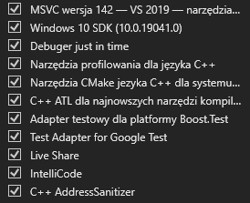

# cpL GraVeyard Project
Projekt zaliczenia
- cpL Unknown Wish (silnik gry CPL2)
- cpL CIG image file format (format obrazów dla szybkiego ładowania)
- cpL cpLTec system

# Setup

- Visual Studio Community 2019 (v142)
- MSVC v142 - VS2019 tools dla architektury x64/x86
- C++ ATL v142 dla x64/x86
- Windows 10 SDK (w moim przypadku 10.0.19041.0)

# Format Y1

Format Y1 to format zapisu wielu plików w jednym, w celu optymalizacji pod względem ładowania go z dysku. W obecnych czasach nie ma z tym problemu, jednakże w latach 90-tych to rozwiązanie było kluczowe dla płynnej rozgrywki z dynamicznym ładowaniem zasobów. Y1 w dużej mierze bazuje na formacie PAK z gry Quake (1996), która nadal jest wyznacznikiem dla optymalizacji gier.

# Format CIG

Format CIG to format zapisu zdjęcia mającego na celu załadować do pamięci GPU tekstury tak szybko jak to możliwe. Format nie posiada kompresji w zapisie, kompresja następuje tylko przy konwersji z innych formatów.

Struktura CIG zakłada minimum infomacji w zapisie, bez informacji kontrolnych, sum kontrolnych itd. Jedyna informacja niezwiązana z obrazem zapisanym to id wersji. Zaimplementowana została 0.2 (w __int8 to 2)

- 1 bit kanału alfa
- 5 bitów red
- 5 bitów green
- 5 bitów blue

# Implementacja shared-variables

Header "cpl.h" zawiera implementacje shared variables memory, która pozwala na zmiane zmiennych programu po nazwach, bez znajomości adresu / pointera zmiennej.

- znak t to tekstura (unsigned __int32)
- znak i to numer (__int32)
- znak c to tekst (__int8*)

System ma dwa rodzaje identyfikacji zmiennej:
- bezpośredni (pobieramy id (CPLMEM) zmiennej po nazwie), dzięki czemu pobieramy wartość bezpośrednio, bez sprawdzania wszystkich zmiennych / zalecane do zmiennych często modyfikowanych/odczytywanych
- pośredni (pierwszy parametr to nazwa zmiennej), funkcja sprawdza wszystkie zmienne i zwraca wartość

W przypadku gdy ów zmienna nie istnieje / nie ma wartości danego typu etc. wartość zwrotna wynosi 0

# Biblioteki

Biblioteki są czysto windows-vanilla, czyli wbudowane co też nawiązuje do stylu gier lat 90-tych, gdzie każda gra była w dużej mierze pisana pod konkretną platformę. Te które zyskiwały na popularności były dostosowywane do innych systemów, co dało początek "portingowi". Stwierdziłem że jest to charakterystyczną cechą, której nie mogę pominąć a samo portowanie gier było tak rozległe, że istniały nawet osobne firmy zajmujące się tylko i wyłącznie portowaniem z gier, później także innych programów i/lub aplikacji.

- Implementacja OpenGL w wersji 1.0 (opengl32.lib)
- Implementacja GLU (glu32.lib)
- Implementacja XAudio2 (xaudio2.lib) (pod windows 10+ oraz dla późniejszej implementacji audio 3D / 8D)

# Tekstury
tekstury pochodzą z gry Kapitan Pazur (1997)
